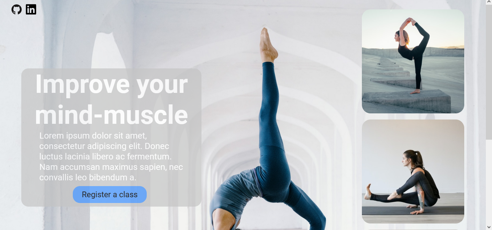
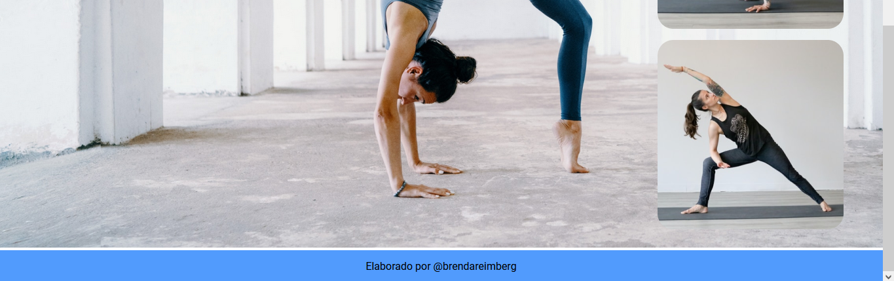

# Landing Page - Mind-muscle  

O presente repositório possui arquivos html, css e pasta de imagem que foi utilizada no processo de criação. O layout foi retirado do [Figma](https://www.figma.com/file/FvH52ctmLt8q9m7Lydv02s/50%2B-Landing-page-designs-(Community)?type=design&node-id=868-162&mode=design). Página criada para treinamento em HTML e CSS.

## RESULTADO

## Observação
No momento a página não possui responsividade. Em breve será atualizado 👍